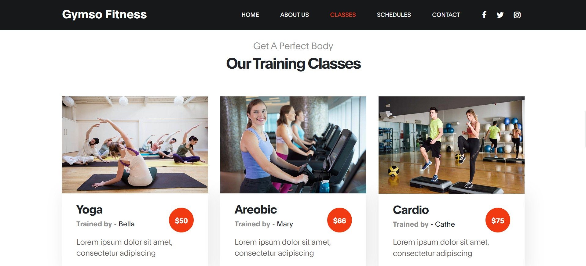

# Gym Management System

A modern web-based Gym Management System built with Django. This project helps gym owners manage classes, trainers, and memberships, and provides a beautiful, responsive frontend for users.

## Features

- User-friendly landing page
- Class schedules and trainer profiles
- Responsive design (HTML, CSS, JavaScript)
- Django backend for data management
- Static assets for images, CSS, and JS

## Demo


### Assets Preview

#### Class Images

| Cardio Class | Crossfit Class | Yoga Class |
|:---:|:---:|:---:|
|  |  |  |

#### Team Images

| Team 1 | Team 2 |
|:---:|:---:|
|  |  |

## Getting Started

### Prerequisites

- Python 3.11+
- pip
- Virtual environment (recommended)

### Installation

1. Clone the repository:

   ```bash
   git clone https://github.com/udoydev/Gym.git
   cd GYM
   ```

2. Create and activate a virtual environment:

   ```bash
   python -m venv gym_env
   source gym_env/Scripts/activate  # On Windows
   # source gym_env/bin/activate    # On macOS/Linux
   ```

3. Install dependencies:

   ```bash
   pip install -r requirements.txt
   ```

4. Run migrations:

   ```bash
   python manage.py migrate
   ```

5. Start the development server:

   ```bash
   python manage.py runserver
   ```

6. Open your browser and go to `http://127.0.0.1:8000/`

## Project Structure

```text
GYM/
├── gym/                # Django project settings
├── gym_app/            # Main application
│   ├── static/         # Static files (CSS, JS, images)
│   └── templates/      # HTML templates
├── db.sqlite3          # SQLite database
├── requirements.txt    # Python dependencies
├── LICENSE             # MIT License
├── README.md           # Project documentation
└── assests_readme.md/  # Assets for README preview
```

## Contributing

Pull requests are welcome! For major changes, please open an issue first to discuss what you would like to change.

## License

This project is licensed under the MIT License - see the [LICENSE](LICENSE) file for details.

## Author

Md Imran Nazir Udoy
